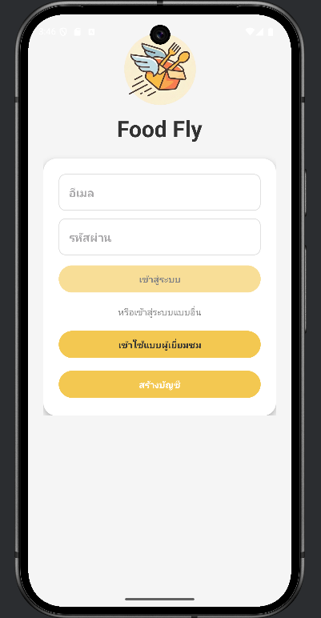
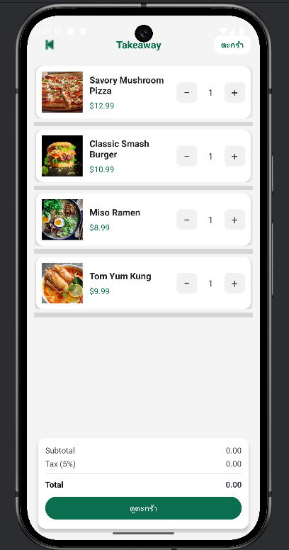
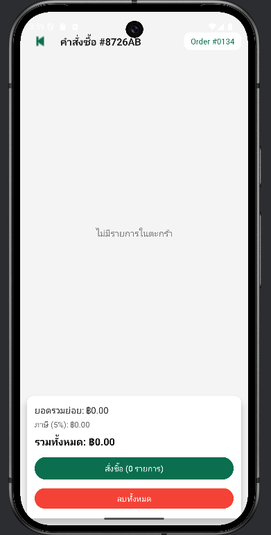
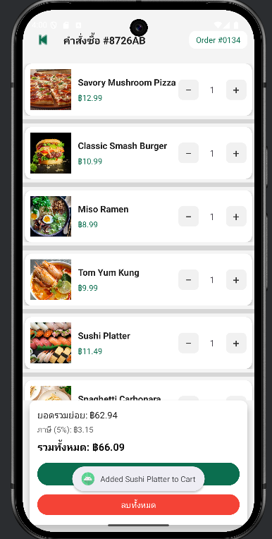

## แอปพลิเคชันสั่งอาหาร FlyFood

โปรเจกต์นี้เป็นแอปพลิเคชันสั่งอาหารบนระบบ Android ที่ผมทำขึ้นเพื่อฝึกเขียนโปรแกรมด้วยภาษา Kotlin และฝึกออกแบบหน้าจอด้วย XML โดยภายในแอปจะมีเมนูอาหาร หน้าโปรโมชั่น และระบบตะกร้าสินค้า

แอปนี้เป็นโปรเจกต์ทดลอง ข้อมูลต่าง ๆ จะถูกเก็บไว้ในเครื่องด้วย SQLite ยังไม่ได้เชื่อมต่อกับเซิร์ฟเวอร์ ระบบชำระเงินจริง หรือระบบจัดส่งอาหารจริง

## วัตถุประสงค์ของโปรเจกต์

- เพื่อฝึกสร้างแอปพลิเคชัน Android ด้วยภาษา Kotlin
- เพื่อฝึกออกแบบหน้าจอและจัดวางองค์ประกอบด้วย XML
- เพื่อศึกษาการส่งข้อมูลและเปลี่ยนหน้าด้วย Activity และ Intent
- เพื่อฝึกเก็บและจัดการข้อมูลภายในเครื่องด้วย SQLite
- เพื่อทดลองทำระบบตะกร้าสินค้าและคำนวณราคาอาหาร

## รูปภาพตัวอย่าง

| หน้าเข้าสู่ระบบ | หน้าหลัก | หน้าโปรโมชั่น |
| --- | --- | --- |
|  |  |  |

| หน้าสั่งกลับบ้าน | หน้าตะกร้า | หน้ายืนยันคำสั่งซื้อ |
| --- | --- | --- |
|  |  |  |


## เครื่องมือที่ใช้

- Android Studio
- ภาษา Kotlin
- XML Layout
- SQLite Database
- AndroidX และ Material Components
- Gradle Kotlin DSL


วิธีเปิดโปรเจกต์

1. ดาวน์โหลดหรือ Clone โปรเจกต์นี้ลงในเครื่อง
2. เปิดโฟลเดอร์โปรเจกต์ด้วย Android Studio
3. รอให้โปรแกรม Gradle Sync ให้เสร็จ
4. เปิด Emulator หรือเชื่อมต่อโทรศัพท์ Android
5. กดปุ่ม Run เพื่อทดลองใช้งานแอป

โปรเจกต์กำหนด Android ขั้นต่ำไว้ที่ Android 7.0 หรือ API 24

ถ้าต้องการทดสอบ Build บน Windows สามารถใช้คำสั่ง

```powershell
.\gradlew.bat assembleDebug
```


สิ่งที่อยากพัฒนาต่อ
1.ทำระบบสมัครสมาชิกและเข้าสู่ระบบให้เก็บข้อมูลได้จริง
2.เชื่อมต่อ API หรือฐานข้อมูลออนไลน์
3.เพิ่มประวัติการสั่งซื้อ
4.เพิ่มระบบค้นหาและกรองประเภทอาหาร
5.เพิ่มระบบชำระเงิน
6.ปรับโครงสร้างโค้ดให้เป็นระเบียบและเพิ่มการทดสอบ
